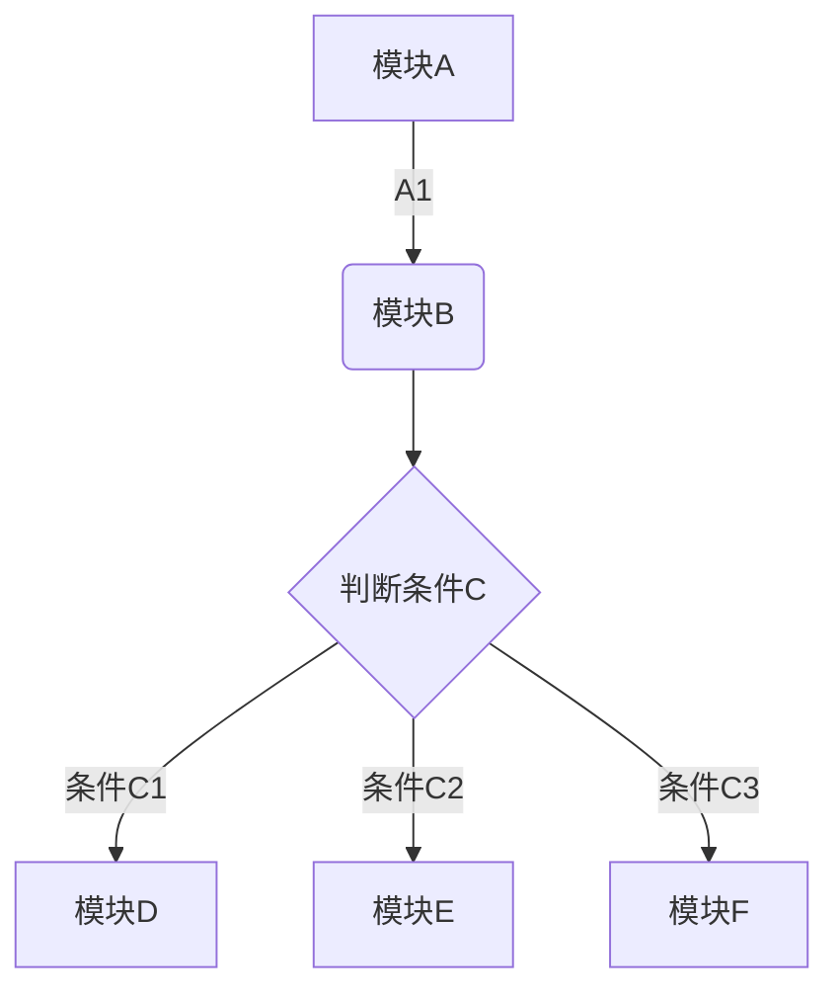
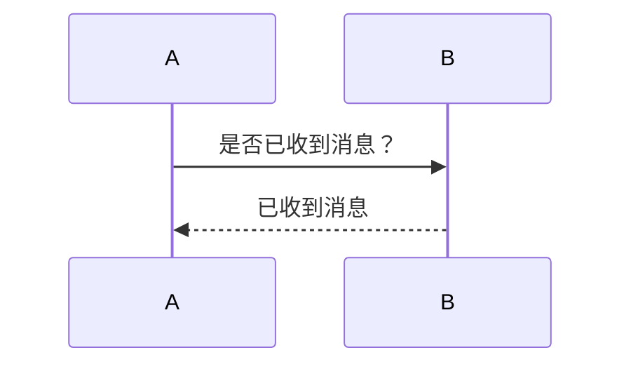
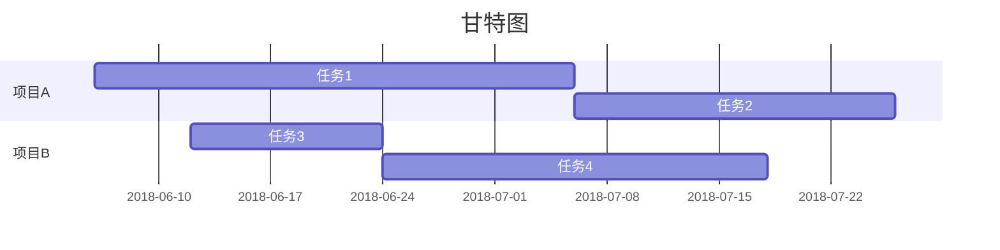

## 文件类操作
- 检索某一目录下的文件,命令为**find 文件路径 -iname "正则表达式"**，必须指定路径。
>例如，使用下面的命令可以用来检索~/Company/路径下面以txt为扩展名的文件
```xml
find /Users/shuyunfeng/Work/Company -iname ".txt"
```
- 使用mdfind命令搜索文件，命令为**mdfind -name "文件名称" or 文件名称 or 后缀名称**，检索出的文件，其文件名称包含命令中引号中字样；若该检索命令为全键盘检索，若要限定检索范围，则需要在mdfind后面添加**-onlyin 文件路径**等限定修饰。还可以将引号中的参数替换为语句，用来检索文件中包含该语句的文件，**但是这种通过文件内容检索文件的方式，所得出的检索结果并不完全匹配**。
>例如，可以使用下面的命令在全盘检索文件名称包含“组诗”的文件
```xml
mdfind -name "组诗"
```
>或者添加检索位置限定，命令如下
```xml
mdfind -onlyin /User/shuyunfeng "组诗"
```
>检索文件内容中包含特定语段的方式检索，命令如下
```xml
mdfind "周芷若"
```
- 使用系统自带的SpotLight来检索文件，无法使用正则表达式，检索结果并不完全匹配。
- 按住command点击dock中的APP图标，进入对应APPfinder位置
- 按住option键，点击菜单栏左侧Apple图标
- 在浏览器中选中一段文字，然后按住拖动到桌面，然后就生成了以这段文本为内容的.textcliping文件
- Safari直接下载PDF文件，按住option键，然后点击浏览器地址栏即可
- 在终端中输入 say+英语单词句子或者中文，会语音输出
- 使用多功能截屏时，点击空格键可以在在窗口和自选区域两种方式间切换
- 按住option和shift键，在按F11或F12键可以实现微调音量

## 终端命令输出至文件
- 如果想将终端中的命令输出导出至文件，则可依次执行初始命令，命令导出至文件的命令。例如要想将ls命令的输出导出至桌面的ls.txt文本中，则可以依次执行下面的命令。
```xml
bogon:~ shuyunfeng$ ls
Applications		    OneDrive
Desktop					OneDrive - Cooperative Office System
Development				Personnel
Documents				Pictures
Downloads				Program
Library					Public
Movies					Work
Music
bogon:~ shuyunfeng$ ls > ~/Desktop/ls.txt
bogon:~ shuyunfeng$ cd ~/Desktop/
bogon:Desktop shuyunfeng$ ls
ls.txt
bogon:Desktop shuyunfeng$ cat ls.txt
Applications
Desktop
Development
Documents
Downloads
Library
Movies
Music
OneDrive
OneDrive - Cooperative Office System
Personnel
Pictures
Program
Public
Work
bogon:Desktop shuyunfeng$
```
其他用法见：
https://www.helplib.com/Mac/article_11402

## 打开finder终端所在目录
```xml
open .
```
## finder相关
- finder中显示隐藏文件，先执行下面的命令，再重启finder。或者使用快捷键**shift+command+.**。
```xml
defaults write com.apple.finderAppleShowAllFiles -bool true
```
- finder标题栏显示当前所在路径，命令为
```xml
defaults write com.apple.finder _FXShowPosixPathInTitle -bool YES
```

## 终端自动补全忽略大小写
> 打开终端,输入**su root**,以根用户登录，然后执行**nano .inputrc**打开inputrc文件。在该文件中添加以下代码，然后使用**control o**保存，重启终端即可。
```xml
set completion-ignore-case on
set show-all-if-ambiguous on
TAB: menu-complete
```

## 终端常用命令
- ls #罗列当前目录下的内容
- ls -a #显示当前目录下子文件及目录详情，包括隐藏文件及目录
- ls -l #显示当前目录下子文件及目录详情
- cd #更换工作目录
- pwd #显示当前完整工作目录
- touch #创建一个文件
- mv #移动/更名文件或目录
- rm #删除文件活目录
- nano #使用 nano 编辑纯文本文件
- open #打开一个文件，并在文本编辑器中打开
- cat #将一个文件的全部内容输出在终端页面上，方便复制和查看
- vim #启动文件编辑模式，不便于全页查看和复制，建议使用open命令
- echo $JAVA_HOME #打印出JAVA_HOME值，即就是JDK安装全路径，设置位于~/.bash_profile文件中
- file ${absolutePath} #显示文件信息
- clear #清空屏幕
- sudo #用管理员身份去执行一个命令

## 进入APP界面按住option键，可以使得APP右上角出现删除❌；使用option+空格键即可长久地出现❌。
## 鼠标右击dock中偏好设置图标，可以调出各设置向的下拉列表，同样鼠标右击发射台可调出应用下拉列表。

## 修改主机名称
```xml
echo $HOSTNAME
sudo scutil --set HostName 新的主机名称
```

##修改Mac软件安装来源许可
打开/关闭`任意来源`选项
```xml
sudo spctl --master-disable/enable
```

## 获取本机ip
```xml
ifconfig | grep "inet " | grep -v 127.0.0.1
```
## Mac中资源库位置
+ 
+ 
+ 
### Mac应用中包内容位置
+ 


```chart
,Budget,Income,Expenses,Debt
June,5000,8000,4000,6000
July,3000,1000,4000,3000
Aug,5000,7000,6000,3000
Sep,7000,2000,3000,1000
Oct,6000,5000,4000,2000
Nov,4000,3000,5000,

type: line
title: Monthly Revenue
x.title: Amount
y.title: Month
y.suffix: $
```
```chart
,Budget,Income,Expenses,Debt
June,5000,8000,4000,6000
July,3000,1000,4000,3000
Aug,5000,7000,6000,3000
Sep,7000,2000,3000,1000
Oct,6000,5000,4000,2000
Nov,4000,3000,5000,

type: pie
title: Monthly Revenue
x.title: Amount
y.title: Month
y.suffix: $
```
```chart
,Budget,Income,Expenses,Debt
June,5000,8000,4000,6000
July,3000,1000,4000,3000
Aug,5000,7000,6000,3000
Sep,7000,2000,3000,1000
Oct,6000,5000,4000,2000
Nov,4000,3000,5000,

type: bar
title: Monthly Revenue
x.title: Amount
y.title: Month
y.suffix: $
```
```chart
,Budget,Income,Expenses,Debt
June,5000,8000,4000,6000
July,3000,1000,4000,3000
Aug,5000,7000,6000,3000
Sep,7000,2000,3000,1000
Oct,6000,5000,4000,2000
Nov,4000,3000,5000,

type: column
title: Monthly Revenue
x.title: Amount
y.title: Month
y.suffix: $
```

```math
e^{i\pi} + 1 = 0
```





