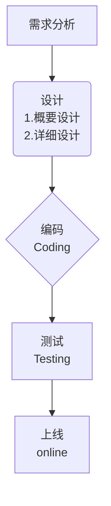

<!-- @import "[TOC]" {cmd="toc" depthFrom=1 depthTo=6 orderedList=false} -->

<!-- code_chunk_output -->

* [PL/SQL](#plsql)
	* [PL/SQL 程序结构](#plsql-程序结构)
	* [定义变量](#定义变量)
	* [IF 语句](#if-语句)
	* [循环语句](#循环语句)
	* [光标](#光标)
		* [光标结构](#光标结构)
		* [光标的属性](#光标的属性)
		* [光标数的限制](#光标数的限制)
		* [无参光标](#无参光标)
		* [有参光标](#有参光标)
	* [例外 exception](#例外-exception)
		* [no_data_found](#no_data_found)
		* [too_many_rows](#too_many_rows)
		* [zero_divide](#zero_divide)
		* [value_error（算术或转换错误）](#value_error算术或转换错误)
		* [timeout_on_resource（等待资源时发生超时）](#timeout_on_resource等待资源时发生超时)
		* [custom exception](#custom-exception)
	* [综合示例](#综合示例)

<!-- /code_chunk_output -->

# PL/SQL

## PL/SQL 程序结构

``` sql
declare
   // 说明部分（变量说明、光标说明、列外说明）
   // 无，则可以省略
begin
   // 语句序列（DML 语句）
exception
   // 例外处理语句
   // 无，则可以省略
end;
/
```

## 定义变量

* 定义基本变量
  * 类型：char, varchar2, date, number, boolean, long
  * 举例：
    * var1    cahr(15);
    * married boolean := true;
    * psal    number(7, 2);

* 定义引用型变量
  * 举例：
    * my_name emp.ename%type

* 记录型变量
  * 举例：
    * emp_rec emp%rowtype;
    * > 代表一行，对应变量为一对象，包含各列对应属性
  * 记录型变量分量的引用
    * emp_rec.ename := 'ADAMS';

## IF 语句

$类型一$

``` sql
if 条件 then 语句1;
语句2;
end if;
```

$类型二$

``` sql
if 条件 then 语句;
else 语句;
end if;
```

$类型三$

``` sql
if 条件 then 语句;
elseif 语句 then 语句;
else 语句;
end if;
```

## 循环语句

$while循环$

``` sql
set serverouput on
declare
 pnum number := 1;
begin
 while pnum <= 10 loop
  dbms_output.put_line(pnum);
  pnum := pnum + 1;
 end loop;
end;  
/
```

$loop循环$

``` sql
set serverouput on
declare
   pnum number := 1;
begin
   loop
   exit when pnum > 10;
   dbms_output.put_line(pnum);
   pnum := pnum + 1;
   end loop;
end;
/
```

$for循环$

``` sql
set serveroutput on
declare
   pnum number := 1;
begin
   for pnum in 1..10 loop;
   dbms_output.put_line(pnum);
   end loop;
end;
/
```  

> 推荐使用第二种循环语句，控制光标比较方便。

## 光标

> 相当于一个结果集（Result Set），各列对应的的数据集合。

### 光标结构

``` sql
-- 定义光标
cursor 光标名称 [(参数名 数据类型[,参数名 数据类型]...)]
is select 语句;
-- 打开光标（打开光标执行查询）
open c1;
-- 关闭光标（关闭光标释放资源）
close c1;
-- 取一行光标的值（从光标(集合)中取出一个元素赋值给变量 pename）
fetch c1 into pename;
```

### 光标的属性

* `%found` 与 `%notfund` boolean 类型
* `%isopen` 判断光标是否打开
* `%rowcount` 受影响的行数

### 光标数的限制

通常打开一个光标，使用完毕后需要关闭，如未及时关闭光标，则对未打开光标有一个数量限制，在 Oracle 数据库中规定在同一个会话中只允许打开 **300** 个光标。
修改该限制：进入 sys 用户，并执行下面的第四行语句

``` sql
connect sys/password@ip:1521/orcl as sysdba
show user
show paramter cursor
alter system set open_cursors = 400 scope = both;
show paramter cursor
```

scope 的取值有 `both`， `memory`，`spfile`</br>
其中 scope 设为 memory 时，修改只对当前实例有效；设为 spfile 时，修改只对参数文件有效，且需要重启数据库；设为 both 时，修改对当前实例和参数文件均有效。

### 无参光标

$示例$

* 查询员工姓名和工资，并打印

``` sql
-- 打开打印服务
set serveroutput on
declare
   -- 定义一个光标
   cursor cemp is select ename,sal from emp;
   -- 为光标定义对应的存储变量
   pename emp.ename%type;
   psal   emp.sal%type;
begin
   -- 打开光标
   open cemp;

   loop
      -- 取出一个元素
      fetch cemp into pename,psal;
      -- 当元素取完后退出循环
      exit when cemp%notfound;
      -- 打印结果
      dbms_output.put_line(pename||'的薪水是'||psal);
   end loop;
   -- 关闭光标
   close cemp;
end;
/
```

* 按职位给员工涨工资

``` sql
-- 给员工涨工资，总裁1000，经理800，其他400
set serveroutput on
declare
   -- 定义光标代表给哪些员工涨工资
   cursor cemp is select empno,empjob from emp;
   pempno  emp.empno%type;
   pempjob emp.empjob%type;
begin
   -- rollback;
   -- 打开光标
   open cemp;

   loop
      -- 取出一对元素
      fetch cemp into pempno,pempjob;
      -- 当元素取完后退出循环
      exit when cemp%notfound;
      -- 判断员工的职位，并涨相应额度工资
      if pempjob = 'PRESIDENT' then update emp set sal = sal + 1000 where empno = pempno;
         elseif pempjob = 'MANAGER' then update emp set sal = sal + 800 where empno = pempno;
         else update emp set sal = sal + 400 where empno = pempno;
      end if;
   end loop;
   -- 关闭光标
   close cemp;
   -- 对于 Oracle 数据库，默认的事务隔离级别是 read committed，所以需要对上面的代码进行提交操作，才能生效
   -- 事务具有ACID(即原子性、一致性、隔离性和持久性)
   commit;
   dbms_output.put_line('涨工资完成');
end;
/
```

### 有参光标

$示例$

* 查询某个部门中员工的姓名

``` sql
set serveroutput on
declare
   -- 定义有参光标
   cursor cemp(dno number) is select ename from emp where deptno = dno;
   pempname emp.ename%type;
begin
   -- 打开光标，需要向上述光标传递参数
   open cemp(10);
   loop
      fetch cemp into pempname;
      exit when cemp%notfound;
      dbms_output.put_line(pempname);
   end loop;
   close cemp;
end;
/
```

## 例外 exception

* 系统例外
* 自定义例外

### no_data_found

``` sql
set serveroutput on
declare
   pename emp.ename%type;
begin
   select ename into pename from emp where empno = 1234;
exception
   when no_data_found then dbms_output.put_line('没有找到该员工');
   when others then dbms_output.put_line('其他例外');
   -- 建议在 plsql 中捕获所有的例外，而不是向外抛出例外，避免影响数据库运行状况
end;
/  
```

### too_many_rows

``` sql
set serveroutput on
declare
   pename emp.ename%type;
begin
   select ename into pename from emp where deptno = 10;
exception
   when too_many_rows then dbms_output.put_line('select into 匹配了多行');
   when others then dbms_output.put_line('其他例外');
   -- 建议在 plsql 中捕获所有的例外，而不是向外抛出例外，避免影响数据库运行状况
end;
/  
```

### zero_divide

``` sql
set serveroutput on
declare
   pnum number;
begin
   pnum := 1 / 0;
exception
   when zero_divide then dbms_output.put_line('1.0不能做除数');
                         dbms_output.put_line('2.0不能做除数');
   when others then dbms_output.put_line('其他例外');
   -- 建议在 plsql 中捕获所有的例外，而不是向外抛出例外，避免影响数据库运行状况
end;
/  
```

### value_error（算术或转换错误）

``` sql
set serveroutput on
declare
   pnum number;
begin
   pnum := 'abc';
exception
   when value_error then dbms_output.put_line('算术或转换错误');
   when others then dbms_output.put_line('其他例外');
   -- 建议在 plsql 中捕获所有的例外，而不是向外抛出例外，避免影响数据库运行状况
end;
/  
```

### timeout_on_resource（等待资源时发生超时）

### custom exception

* 定义变量，类型为 exception
* 使用 raise 抛出自定义例外

``` sql
-- 查询50号部门的员工姓名
set serveroutput on
declare
   -- 定义光标来代表50号部门的员工姓名
   cursor cemp is select ename from emp where deptno = 50;
   pename emp .ename%type;
   -- 自定义例外
   no_emp_found exception;
begin
   open cemp;
   fetch cemp into pename;
   if cemp%notfound then
      raise no_emp_found;
   end if;
   -- 当程序出现异常，Oracle 会自动启动 pmon(process monitor) 来关闭用户打开的资源和垃圾
   close cemp;
exception
   when no_emp_found then dbms_output.put_line('没有找到员工');
   when others then dbms_output.put_line('其他例外');
end;
/
```

## 综合示例

采用瀑布模型进行 plsql 程序设计。



* 示例1：统计每年入职员工人数

``` sql
set serveroutput on
declare
   cursor cemp is select to_char(hiredate, 'yyyy') from emp;
   phiredate varchar2(24);
   count80 number := 0;
   count81 number := 0;
   count82 number := 0;
   count87 number := 0;
begin
   open cemp;
   loop
      fetch cemp into phiredate;
      exit when cemp%notfound;
      if phiredate = '1980' then count80 := count80 + 1;
         elseif phiredate = '1981' then count81 := count81 + 1;
         elseif phiredate = '1982' then count82 := count82 + 1;
         else count87 := count87 + 1;
      end if;
   end loop;
   close cemp;

   dbms_output.put_line('Total: ' || (count80 + count81 + count82 + count87));
   dbms_output.put_line('1980:' || count80);
   dbms_output.put_line('1982:' || count82);
   dbms_output.put_line('1987:' || count87);
end;
/
```

* 示例2：员工涨工资


``` sql
-- sql 语句
-- select empno,sal from emp order by sal;
-- -> 光标 -> 循环 -> 退出条件：1.工资总额 > 5w;2.%notfound
-- 变量：
--    涨工资的人数：
--    countEmp number := 0;
--    涨后工资总额：
--    salTotal number;
--    1. select sum(sal) into salTotal from emp;
--    2.账后的工资总额 = 涨前的工资总额 + sal * 0.1

set serverouput on
declare
   cursor cemp is select empno, sal from emp order by sal;
   pempno emp.empno%type;
   psal   emp.sal%type;
   countEmp number := 0;
   salTotal number;
begin
   -- 得到工资总额的初始值
   select sum(sal) into salTotal from emp;
   open cemp;
   loop
      -- 退出条件1:工资总额大于5万
      exit when salTotal > 50000;
      -- 取一个员工的信息
      fetch cemp into pempno, psal;
      -- 退出条件2:%notfound
      exit when cemp%notfound;
      -- 计算该员工涨工资之后所有员工工资总额，并据此判断是否给该员工涨工资
      salTotal := salTotal + psal * 0.1;
      if salTotal <= 50000 then
         -- 执行涨工资
         update emp set sal = sal * 1.1 where empno = pempno;
         -- 涨工资人数加1
         countEmp ：= countEmp + 1;
      end if;
   end loop;
   close cemp;
   -- 对于 Oracle 数据库，默认的事务隔离级别是 read committed，所以需要对上面的代码进行提交操作，才能生效
   -- 事务具有ACID(即原子性、一致性、隔离性和持久性)
   commit;
   dbms_output.put_line('人数：' || countEmp || ' 账后工资总额：' || salTotal)
end;
/
```

* 示例3：


``` sql
-- 创建表，用来保存结果
create table msg (
   deptno number,
   count1 number,
   count2 number,
   count3 number,
   total number
);
```

SQL 语句分析

1. 有哪些部门：
   1. select deptno from dept;
   2. 光标 --> 循环 --> 退出条件：notfound
2. 部门员工的薪水
   1. select sal from emp where deptno = ?
   2. 带一个参数的光标 --> 循环 --> 退出条件：notfound
3. 变量： 1.初始值 2.如何得到
4. 每个薪资段的员工人数
   1. count1 number;
   2. count2 number;
   3. count3 number;
5. 每个部门员工工资总额
   1. salTotal number;
   2. select sum(sal) into salTotal from emp where deptno = ???
   3. 累加

``` sql
set serveroutput on
declare
   -- 定义部门编号集合变量及单变量
   cursor cdept is select deptno from dept;
   pdeptno dept deptno%type;

   -- 定义所属部门员工工资集合变量及单变量
   cursor cemp(dno number) is select sal from emp where deptno = dno;
   psal emp.sal%type;

   -- 每个薪资段的员工人数
   count1 number;
   count2 number;
   count3 number;

   -- 每个部门员工工资总额
   salTotal number;
begin
   open cdept;
   -- 外部循环
   loop
      fetch cdept into pdeptno;
      exit when cdept%notfound;
      select sum(sal) into salTotal from emp where deptno = pdeptno;

      count1 := 0;
      count2 := 0;
      count3 := 0;

      open cemp(pdeptno);
      -- 内部循环
      loop
         fetch cemp into psal;
         exit cemp%notfound;
         if psal < 3000 then count1 := count1 + 1;
            elseif psal >= 3000 and psal < 6000 then count2 := count2 + 1;
            else count3 := count3 + 1;
         end if;
      end loop;
      close cemp;

      -- 保存一条记录到 msg 中，其中 
      (var, 0)函数的作用是在 var 为空时，将其显示为 0，
      insert into msg values(pdeptno, count1, count2, count3, nvl(salTotal, 0));
   end loop;
   close cdept;
   commit;
   dbms_output.put_line('统计完成');
end;
/
```

* 示例4：


``` sql
-- 引入表结构
@~student.sql
-- 创建 msg1用来保存结果
create table msg(
   coursename varchar2(20),
   count1 number,
   count2 number,
   count3 number,
   avggrade number
);
```

SQL 语句分析

 1. 得到哪些系
    1. select dno, dname from dep;
    2. 光标 -> 循环 -> 退出条件：notfound
 2. 得到系中，选修了“大学物理 或 ??”课程的学生成绩
    1. select grade from sc where cno = (select cno from course where cname = ??) and sno in (select sno from student where dno = ???);
    2. 带参数的光标 -> 循环 -> 退出条件：notfound
 3. 变量：1.初始值 2.如何得到
 4. 每个分数段的总人数
    1. count1, count2, count3 number;
 5. 每个系选修“大学物理”课程学生平均成绩
    1. avggrade number;
    2. 算数运算
    3. select avg(grade) into avggrade from sc where cno = (select cno from course where cname = ??) and sno in (select sno from student where dno = ??);

``` sql
set serveroutput on
declare
   cursor cdept is select dno, dname from dep;
   pdno dep.dno%type;
   pdname dep.dname%type;

   cursor cgrade(pcourseName varchar2, depno number) 
   is select grade from sc where cno = (select cno from course where cname = coursename) 
   and sno in (select sno from student where dno = depno);
   pgrade sc.grade%type;

   -- 每个分数段的学生人数
   count1 number;
   count2 number;
   count3 number;

   -- 每个系的学生单一课程平均成绩
   avggrade number;

   -- 定义课程名称为 “大学物理”
   pcourseName varchar2 := '大学物理';
begin
   open cdept;
   loop
      fetch cdept into pdno, pdname;
      exit when cdept%notfound;

      select avg(grade) into avggrade from sc where cno = (select cno from course where cname = pcourseName) and sno in (select sno from student where dno = pdno);

      count1 := 0;
      count2 := 0;
      count3 := 0;

      open cgrade(pcourseName, pdno);
      loop
         fetch cgrade into pgrade;
         exit when cgrade%notfound;
         if pgrade < 60 then count1 := count1 + 1;
            elseif pgrade >= 60 pgrade < 85 then count2 := count2 + 1;
            else count3 := count3 + 1;
         end if;
      end loop;
      close cgrade;

      insert into msg values(pcourseName, pdname, count1, count2, count3, avggrade);
   end loop;

   close cdept;
   commit;
   dbms_output.put_line('统计完成');
end;
/
```
